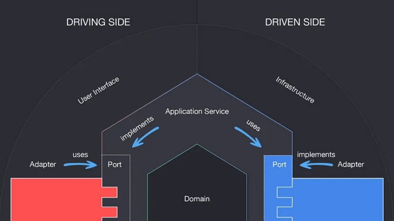

# Projet ERP - P Projet

## **1. Introduction**

Ce projet fait partie d’un **ERP** et a pour objectif de gérer les **projets** en intégrant des données provenant d’autres modules ERP via le **Middle Office**. Voici un aperçu des éléments qu'il couvre :

-   **Saisie de temps** des ressources sur projet
-   **Saisie de projets** avec association d’un client
-   **Simulation** pour évaluer la faisabilité d’honorer les commandes et livrer les clients
-   **Calcul des retards** et estimation des ressources supplémentaires nécessaires
-   **Intégration** des devis et opportunités de vente (pondérées par un pourcentage de chance)

## **2. L'Architecture**

L'application est basée sur une **architecture hexagonale (ports/adapters)** pour assurer une séparation des responsabilités.


### **Les 4 couches principales**

-   **API**

    -   Expose les endpoints REST via ASP.NET Core.
    -   Utilise des **DTOs** pour sérialiser/désérialiser les données.
    -   Contient les **controllers** qui orchestrent les requêtes et les envoient à la couche **Application**.

-   **Application (UseCases)**

    -   Contient la **logique métier**.
    -   Organisée selon un **modèle CQRS** :
        -   **Commands** : pour les actions qui modifient l’état de l’application (ex. création de projet).
        -   **Queries** : pour la récupération de données sans effet de bord (ex. obtenir la liste des projets).

-   **Domain**

    -   Contient les **entités métier** (`Project`, `Ressource`, `Sale`).
    -   Définit les **exceptions métier** (`ProjectExceptions`, `RessourceExceptions`, etc.).
    -   Contient les **repositories abstraits** qui seront implémentés dans **Infrastructure**.

-   **Infrastructure**
    -   Implémente les **repositories** pour la persistance des données.
    -   Contient les **services d’intégration** avec le Middle Office et les autres modules ERP (`ExternalRessourceService`, `ExternalSaleService`).
    -   Fournit des **jobs de synchronisation** (`SyncProjectsBackgroundService`) pour actualiser les données périodiquement.

---

## **3. Fonctionnalités clés et modules interconnectés**

### **3.1. Intégration avec les autres modules**

L’application interagit avec **deux autres modules ERP** via le **Middle Office** :

-   **ACHAT/VENTE** → Récupération des ventes (`Commande`, `Devis`, `Opportunité`).
-   **STORE** → Assignation / désassignation / récupération des ressources pour les projets.

### **3.2. Gestion des projets**

-   Création et mise à jour des projets.
-   Assignation et désassignation de ressources.
-   Simulation de faisabilité pour savoir si un projet peut être honoré.

### **3.3. Synchronisation automatique**

-   Un **background job** met à jour les projets en récupérant périodiquement les nouvelles ventes.

---

## **4. Comment cloner et lancer le projet**

### **4.1. Prérequis**

-   [.NET](https://dotnet.microsoft.com/download)
-   [Visual Studio](https://visualstudio.microsoft.com/fr/downloads/)

### **4.2. Installation**

1. **Cloner le projet**

    ```bash
    git clone https://github.com/ERP-CNAM-3A/backend.git
    ```

2. **Lancer l’application**

3. **Accéder à la documentation Swagger**
    ```
    http://localhost:5256/swagger/index.html
    ```

---

## **5. Endpoints API**

## **1️⃣ Middle Office**

| Méthode | Endpoint     | Description                                                              |
| ------- | ------------ | ------------------------------------------------------------------------ |
| `GET`   | `/meuch_map` | Utilisé par le middle office afin de register certains de nos endpoints. |

---

## **2️⃣ Gestion des Projets**

| Méthode | Endpoint                                       | Description                                                                               |
| ------- | ---------------------------------------------- | ----------------------------------------------------------------------------------------- |
| `GET`   | `/Project/GetAllProjects`                      | Récupère tous les projets gérés par notre service.                                        |
| `GET`   | `/Project/GetProjectById/{id}`                 | Récupère un projet spécifique via son ID.                                                 |
| `GET`   | `/Project/SimulateProjectsDelivery`            | Simule la faisabilité de l'ensemble des projets en fonction des ressources et des ventes. |
| `GET`   | `/Project/SimulateProjectDeliveryById/{id}`    | Simule la faisabilité d’un projet spécifique.                                             |
| `POST`  | `/Project/SyncProjects` _(EXTERNAL)_           | Pour synchroniser les projets avec les ventes.                                            |
| `PUT`   | `/Project/UpdateProject/{id}`                  | Met à jour un projet existant (durée).                                                    |
| `PUT`   | `/Project/AssignRessource/{id}` _(EXTERNAL)_   | Permet de réserver une ressource pour un projet.                                          |
| `PUT`   | `/Project/DeassignRessource/{id}` _(EXTERNAL)_ | Permet de libérer une ressource affectée à un projet.                                     |

---

## **3️⃣ Gestion des Ressources** _(via Middle Office)_

| Méthode | Endpoint                                                | Description                                                        |
| ------- | ------------------------------------------------------- | ------------------------------------------------------------------ |
| `GET`   | `/Ressource/GetAllRessources` _(EXTERNAL)_              | Pour récupérer toutes les ressources.                              |
| `POST`  | `/Ressource/GetAvailableRessourcesBetween` _(EXTERNAL)_ | Pour obtenir la liste des ressources disponibles entre deux dates. |

---

## **4️⃣ Gestion des Ventes** _(via Middle Office)_

| Méthode | Endpoint                              | Description                                                              |
| ------- | ------------------------------------- | ------------------------------------------------------------------------ |
| `GET`   | `/Sale/GetExternalSales` _(EXTERNAL)_ | Pour récupérer les ventes externes (`Commande`, `Devis`, `Opportunité`). |

---

## **6. Documentation et Commentaires**

-   Un **Swagger** est disponible pour documenter l’API.
-   Le **code est commenté** pour faciliter la compréhension et l’évolution du projet.
-   Pour la documentation de l'intégration au Middle Office, se référer au readme du Middle Office

---

## **7. Déploiement et CI/CD**

-   **CI/CD** est mis en place via une **GitHub Actions**
-   Le projet est **conteneurisé avec Docker** et **déployé sur un serveur interne**
-   L’application tourne **24/7** sur notre serveur.

---

## **8. Points Clés de l’Architecture**

### ✅ **Modularité et scalabilité**

-   L’architecture **hexagonale** permet d’ajouter facilement de nouvelles fonctionnalités et entités.
-   Idéale pour un **ERP** qui évolue dans le temps.

### ✅ **Facilité pour les tests**

-   La **séparation des couches** permet des tests unitaires indépendants (on pourrait facilement mocker `ExternalRessourceService` pour tester les projets sans appel à STORE).
-   **CQRS** permet de tester séparément les **commands** et **queries**.

### ✅ **Collaboration avec les autres modules**

-   Un **gros challenge** a été de **définir les besoins** des autres groupes et ce dont nous avions besoin d’eux.
-   Communication avec l’équipe STORE et ACHAT/VENTE (via middle office) pour aligner les informations.
